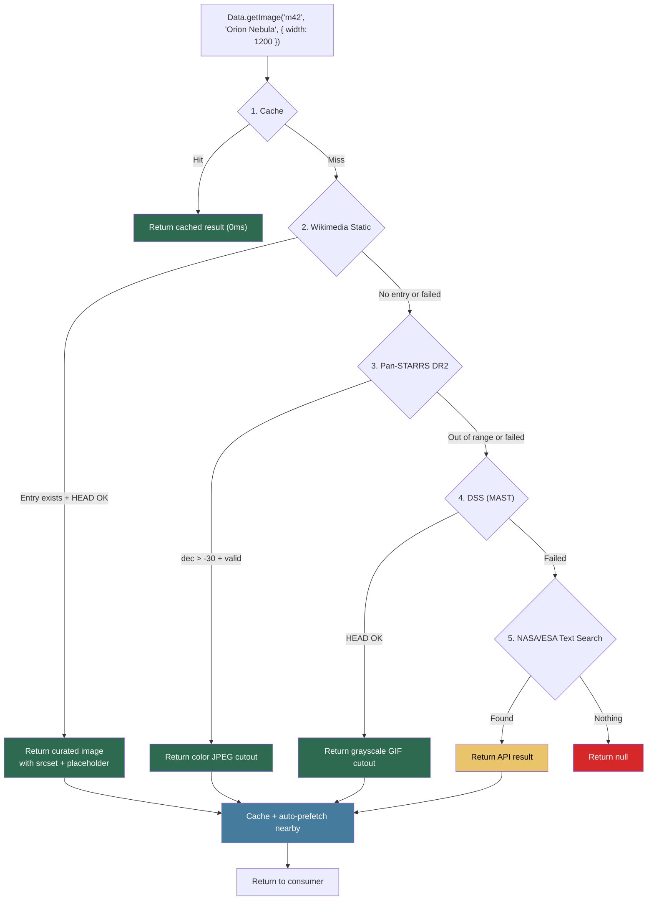
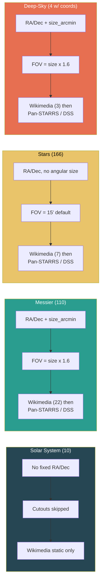
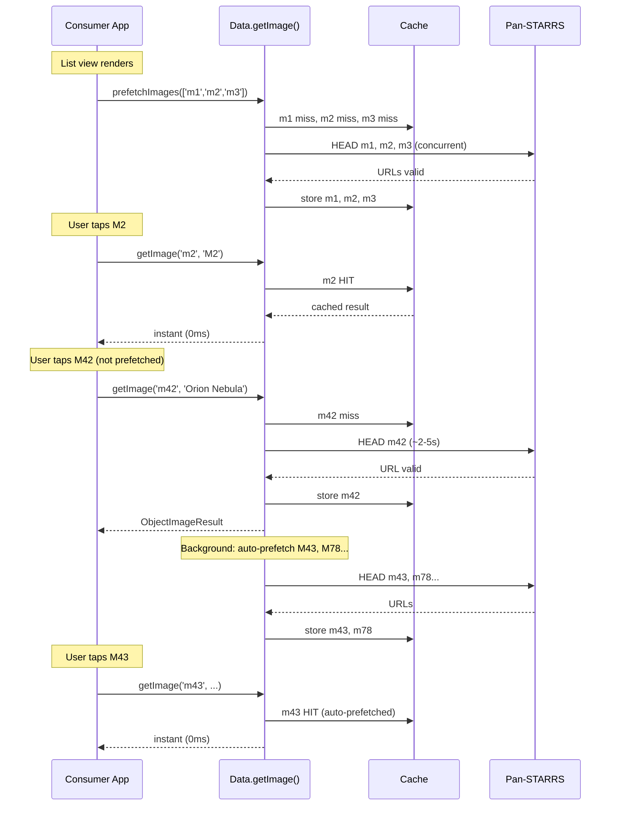

# Guide: Image Pipeline

This guide explains how the cosmos-lib image pipeline resolves the best available image for any celestial object, how coordinate-based cutouts guarantee accuracy, and how to use prefetching for instant image loading.

---

## The Problem

Astronomical images are scattered across many sources (Wikimedia, NASA, ESA, MAST archives). Text-based searches (e.g. searching "Andromeda" on the NASA API) can return wrong or unrelated results. The image pipeline solves this by using **coordinate-based cutout services** that fetch images from exact sky positions -- mathematically guaranteeing the image shows the correct object.

---

## Quick Start

```ts
import { Data } from '@motioncomplex/cosmos-lib'

// Just works -- correct object, proper framing, auto-prefetches neighbors
const img = await Data.getImage('m42', 'Orion Nebula', { width: 1200 })

if (img) {
  heroEl.src = img.src
  heroEl.srcset = img.srcset ?? ''
  creditEl.textContent = img.credit
  console.log(img.source) // 'static' | 'panstarrs' | 'dss' | 'nasa' | 'esa'
}
```

No setup, no API keys, no CDN configuration needed.

---

## Source Cascade

`Data.getImage()` tries sources in priority order and returns the first successful result:



### Source Details

| Source | How it works | Output | Coverage |
|---|---|---|---|
| **Wikimedia Static** | Hand-curated registry of iconic images. HEAD-validates the URL, generates responsive `srcset` and 64px placeholder. | `src` + `srcset` + `placeholder` | ~38 objects (solar system, top Messier, famous stars) |
| **Pan-STARRS DR2** | Fetches a color JPEG (g/r/i composite) from the exact RA/Dec coordinates. FOV is computed from the object's angular size. Uses a precomputed file list to skip the API's file-list step. | `src` only | All objects with dec > -30 (~75% of sky) |
| **DSS (MAST)** | Fetches a grayscale GIF from the Digitized Sky Survey at exact RA/Dec. Full-sky coverage including the southern hemisphere. | `src` only | Full sky |
| **NASA/ESA Text Search** | Searches by object name. Can return incorrect results for ambiguous names. Used only as a last resort for objects without coordinates (or when cutout APIs fail). | `src` only | Any searchable term |

---

## How Objects Are Routed

Different object types take different paths through the cascade:



---

## Field of View Computation

For coordinate-based cutouts, the FOV determines how much sky is shown around the object. Too small and the object is clipped; too large and it's a tiny dot.

The pipeline computes FOV per-object using `computeFov()`:

```
FOV = clamp(size_arcmin * padding, minFov, maxFov)
```

| Parameter | Default | Description |
|---|---|---|
| `size_arcmin` | From catalog | Object's angular diameter. Available for all 110 Messier objects + 4 deep-sky extras. |
| `padding` | `1.6` | Multiplier to show context around the object. |
| `minFov` | `4'` | Floor for very compact objects (planetary nebulae, black holes). |
| `maxFov` | `120'` | Ceiling for very large objects (Andromeda at 190'). |

When `size_arcmin` is not available (stars, some extras), a type-based default is used:

| Type | Default FOV |
|---|---|
| `star` | 15' |
| `galaxy` | 12' |
| `nebula` | 20' |
| `cluster` | 20' |
| `black-hole` | 8' |

**Examples:**

| Object | size_arcmin | Computed FOV |
|---|---|---|
| M42 (Orion Nebula) | 85' | min(85 x 1.6, 120) = **120'** |
| M57 (Ring Nebula) | 1.4' | max(1.4 x 1.6, 4) = **4'** |
| M31 (Andromeda) | 190' | min(190 x 1.6, 120) = **120'** |
| Sirius (star) | -- | default **15'** |

---

## Performance: Prefetching

Cold image fetches (Pan-STARRS cutouts) take ~2-5 seconds. The library provides two mechanisms to hide this latency.

### Auto-Prefetch (Built-In)

When `Data.getImage()` resolves, it automatically finds nearby objects (within 5 degrees) and prefetches their images in the background. This means spatial browsing (M42 -> M43 -> M78) feels instant after the first image loads.

```ts
// First call: ~2-5s (cold fetch from Pan-STARRS)
const img = await Data.getImage('m42', 'Orion Nebula')
// Background: M43, M78, and 6 other nearby objects are now prefetching

// Second call: instant (M43 was auto-prefetched)
const img2 = await Data.getImage('m43', "De Mairan's Nebula")
```

Auto-prefetch is configurable:

```ts
// Wider radius, more neighbors
Data.getImage('m42', 'Orion Nebula', {
  prefetch: { radius: 10, limit: 12 }
})

// Disable auto-prefetch
Data.getImage('m42', 'Orion Nebula', { prefetch: false })
```

### Explicit Prefetch

For list views or search results, prefetch specific objects before the user taps them:

```ts
// When a filtered list renders, prefetch all visible objects
Data.prefetchImages(filteredObjects.map(o => o.id))

// When user taps any of them: instant
const img = await Data.getImage(obj.id, obj.name)
```

### Prefetch Lifecycle



---

## Advanced: Direct Cutout Access

For consumers who need lower-level control over the cutout process, the library exports the individual cutout functions:

```ts
import { computeFov, tryPanSTARRS, tryDSS } from '@motioncomplex/cosmos-lib'

// Compute FOV for a 20-arcminute globular cluster
const fov = computeFov(20, 'cluster') // => 32 arcmin

// Try Pan-STARRS directly
const ps1 = await tryPanSTARRS('m13', 250.42, 36.46, fov, { outputSize: 2048 })
if (ps1) console.log(ps1.url, ps1.credit)

// Try DSS directly
const dss = await tryDSS(250.42, 36.46, fov)
if (dss) console.log(dss.url, dss.credit)
```

### `computeFov(sizeArcmin, objectType, opts?): number`

| Parameter | Type | Description |
|---|---|---|
| `sizeArcmin` | `number \| undefined` | Angular diameter in arcminutes. |
| `objectType` | `string` | Object type for default FOV lookup. |
| `opts` | `{ padding?, minFov?, maxFov? }` | Override defaults. |

### `tryPanSTARRS(id, ra, dec, fovArcmin, opts?): Promise<CutoutResult | null>`

| Parameter | Type | Description |
|---|---|---|
| `id` | `string` | Object ID for precomputed file-list lookup. |
| `ra` | `number` | Right Ascension in degrees (J2000). |
| `dec` | `number` | Declination in degrees (J2000). Must be > -30. |
| `fovArcmin` | `number` | Desired field of view in arcminutes. |
| `opts` | `CutoutOptions` | `{ outputSize?, timeout? }` |

### `tryDSS(ra, dec, fovArcmin, opts?): Promise<CutoutResult | null>`

| Parameter | Type | Description |
|---|---|---|
| `ra` | `number` | Right Ascension in degrees (J2000). |
| `dec` | `number` | Declination in degrees (J2000). |
| `fovArcmin` | `number` | Desired field of view in arcminutes. |
| `opts` | `CutoutOptions` | `{ timeout? }` |

Both return:

```ts
interface CutoutResult {
  url: string                    // Direct image URL
  format: 'jpg' | 'gif'         // Pan-STARRS returns JPEG, DSS returns GIF
  credit: string                 // 'Pan-STARRS/STScI' or 'DSS/STScI'
  source: 'panstarrs' | 'dss'
}
```

---

## Precomputed Pan-STARRS File List

Pan-STARRS normally requires two API calls: one to fetch the per-filter file list, then one to request the cutout. The library embeds a precomputed file list (`src/data/ps1-files.ts`) for all 242 catalog objects with dec > -30, eliminating the first call entirely.

This file is generated by `scripts/generate-ps1-filelist.mjs` and committed to the repository. Re-run it when adding new objects to the catalog:

```bash
node scripts/generate-ps1-filelist.mjs
```

The precomputed data is static (Pan-STARRS DR2 survey data does not change) and adds ~15KB gzipped to the bundle.
